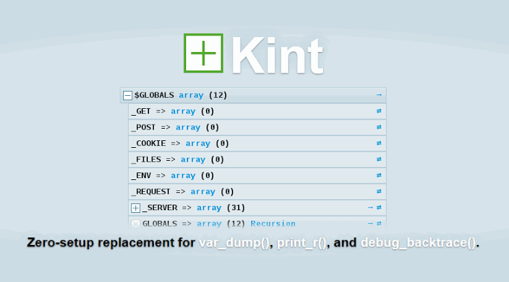

## PHP Logging & Debug With Kint

##### PHP Supported
``` Supported PHP 7.0+ ```

#### Requirements
___
``` N
Need PHP 7.0+ 
Need Composer  
Can be Usage Xampp
```

#### Installations
___
``` 
$ git clone https://github.com/sutin1234/PHP-Logging-Debug-With-Kint.git proj-name
$ cd proj-name
$ composer install | composer require kint-php/kint --dev
```

#### How to Usage
***
``` 
<?php

Kint::dump($GLOBALS, $_SERVER); // pass any number of parameters
d($GLOBALS, $_SERVER); // or simply use d() as a shorthand

Kint::trace(); // Debug backtrace
d(1); // Debug backtrace shorthand

s($GLOBALS); // Basic output mode

~d($GLOBALS); // Text only output mode

Kint::$enabled_mode = false; // Disable kint
d('Get off my lawn!'); // Debugs no longer have any effect
```

##### Tricks & Tips
***
```
1. Kint is enabled by default, set Kint::$enabled_mode = false; to turn it completely off.
2. There are a couple of real-time modifiers you can use:
    * ~d($var) this call will output in plain text format.
    * +d($var) will disregard depth level limits and output everything.
    * !d($var) will expand the output automatically.
    * -d($var) will attempt to ob_clean the previous output and flush after printing.
```

##### Credit
***
[Kint - a powerful and modern PHP debugging tool.](https://github.com/kint-php/kint "Kint Github Homepage")

##### License
___
``Licensed under the MIT License``
